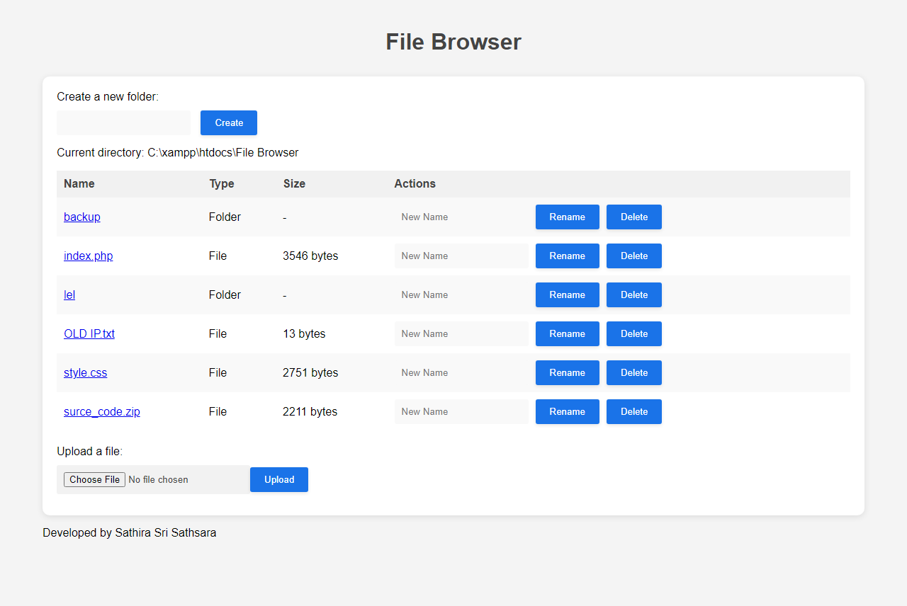

# File Browser - SaM

This is a simple file browser written in PHP that allows you to navigate through your files and directories, create new folders, upload files, rename files/folders, and delete files/folders. The file browser has a basic user interface that displays the current directory path and a table of files and folders with their types and sizes. You can easily customize the file browser by changing the CSS styling or adding new features to the PHP code.

## Installation

To use this file browser, you need to have PHP installed on your server. You can download the PHP files and copy them to your server's directory. Then, you can access the file browser by opening the `index.php` file in your web browser.

Pleace read <a href="https://github.com/SathiraSriSathsara/file-browser/wiki">Wiki page</a> for more details.

## Usage

The file browser displays the current directory path at the top of the page, and a table of files and folders with their types and sizes. You can navigate through your files and directories by clicking on the folder names. To create a new folder, enter a name in the input field and click the "Create" button. To upload a file, click the "Choose File" button and select a file from your computer, then click the "Upload" button. To rename or delete a file/folder, enter the new name (if renaming) or click the "Delete" button (if deleting), and then click the corresponding button.

## License

This project is licensed under the MIT License. You are free to use, copy, modify, and distribute the code as long as you include the license file and give credit to the original author.

## Credits

This file browser was developed by Sathira Sri Sathsara. If you have any questions or comments, you can contact me at sathira@enforcers.lk.

	
	<h4>Sathira Sri Sathsara @ 2023</h4>

	
